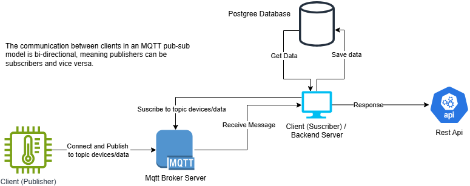
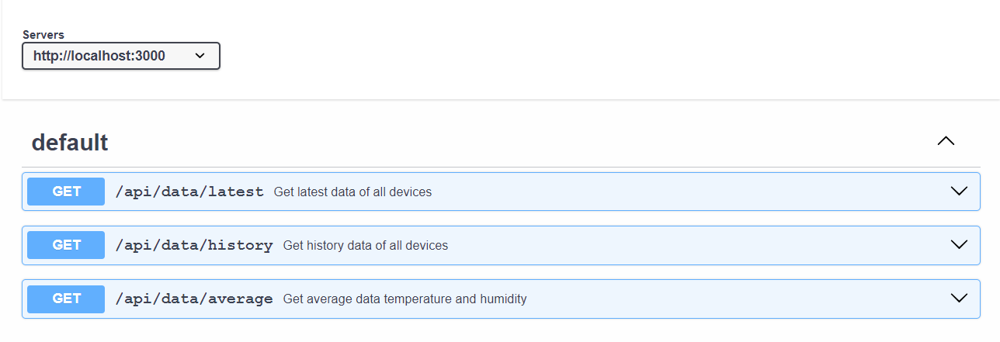

## Architecture Diagram



#### Tools that im used for mqtt

- [mosquitto](https://mosquitto.org/)
- [mqtt-explorer](https://mqtt-explorer.com/)
- [mqtt-library](https://github.com/mqttjs/MQTT.js)

## Project Setup
```bash
git clone https://github.com/ahmdjaee/mqtt-test-sequelize.git
```
cd `mqtt-test-sequelize`
```bash
npm install
```

<!-- Create Database `mqtt_service` and import `db.sql` -->

Create Database `mqtt_service` with PostgreSQL and Run Migration :

```bash
node app/migrations/sync.js
```

Run Server :

```bash
npm run start
```

or for development mode :

```bash
npm run dev
```

Server will be running on http://localhost:3000

## MQTT API Documentation

Mqtt Broker Address, you can change in `app/mqttService.js` if needed

- **`mqtt://localhost:1883`**

Topic

- **`devices/data`**: Topic for receiving data from MQTT broker.

Payload Structure (All fields are required)

- **`devices/data`**
  ```json
  {
    "device_id": "string",
    "humidity": "number",
    "temperature": "number",
    "timestamp": "ISO 8601 string"
  }
  ```

## REST API Documentation

Below is a preview of the API documentation. The complete API documentation can be found in the folder `docs/api-docs.json`. Open it with Swagger to see full the documentation or visit https://app.swaggerhub.com/apis/ptjayaintegrasinusan/data-device_api/1.0.0.


